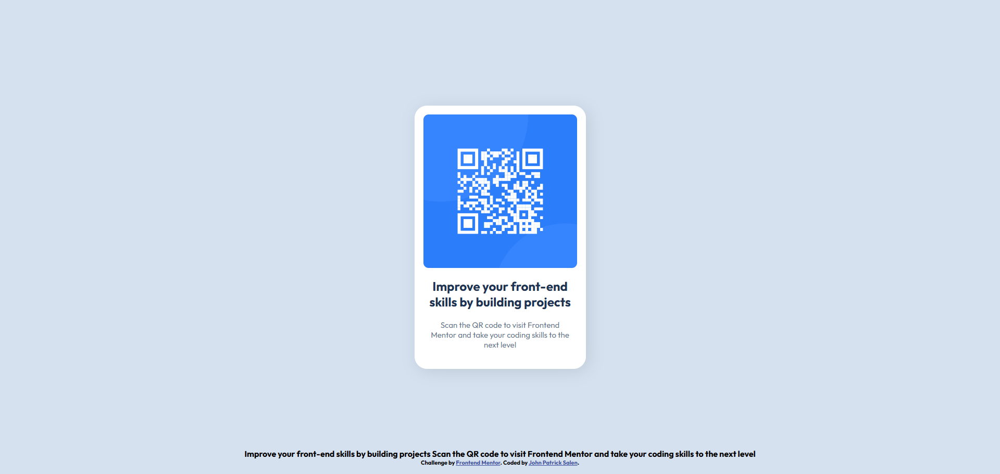

# Frontend Mentor - QR code component solution

This is a solution to the [QR code component challenge on Frontend Mentor](https://www.frontendmentor.io/challenges/qr-code-component-iux_sIO_H). Frontend Mentor challenges help you improve your coding skills by building realistic projects. 

## Table of contents

- [Overview](#overview)
  - [Information](#information)
  - [Screenshot](#screenshot)
  - [Links](#links)
- [My process](#my-process)
  - [Built with](#built-with)
- [Author](#author)
- [Credits](#credits)

## Overview

## Information

This is a challenge present on [Frontend Mentor](https://www.frontendmentor.io) which is about recreating a QR code display on a site.

You may access the challenge here:
- Challenge URL: [QR Code component](https://www.frontendmentor.io/challenges/qr-code-component-iux_sIO_H)

You'll also find the intended look of the site in [Desktop](./preview.jpg) and [Desktop](./design/desktop-design.jpg) [Mobile](./design/mobile-design.jpg) and the stylings [Style guide](./style-guide.md) provided by Frontend Mentor.

### Screenshots

 

### Links

- Live site URL: [Live site](https://standwall5.github.io/qrcodesite)

## My process

I added two containers in order to center the QR code box (QR box was within the main-container div) using flexbox and a flex-direction column within the QR container. 

To ensure the box fits exactly with the QR, img and QR container width were equal while height was auto. Padding was used to add the border, however, the border property can also be used. 

QR image and text elements (grouped within div) were within a flex column which included a row gap value of 20 pixels.

Text elements included the values 0 (top) 10px (left and right) 20px (bottom) for its padding.

### Built with

- HTML5 markup
- CSS custom properties
- Flexbox

### What I learned

Instead of trying to match width and height, it was better to use auto sizing and increase the padding in order to add an equal border.

## Author

- Website - [John Patrick Salen](https://standwall5.github.io/)
- Frontend Mentor - [@standwall5](https://www.frontendmentor.io/profile/standwall5)

## Credits

- Frontend Mentor Site - [Official site](https://www.frontendmentor.io)
- Challenge URL: [QR Code component](https://www.frontendmentor.io/challenges/qr-code-component-iux_sIO_H)
